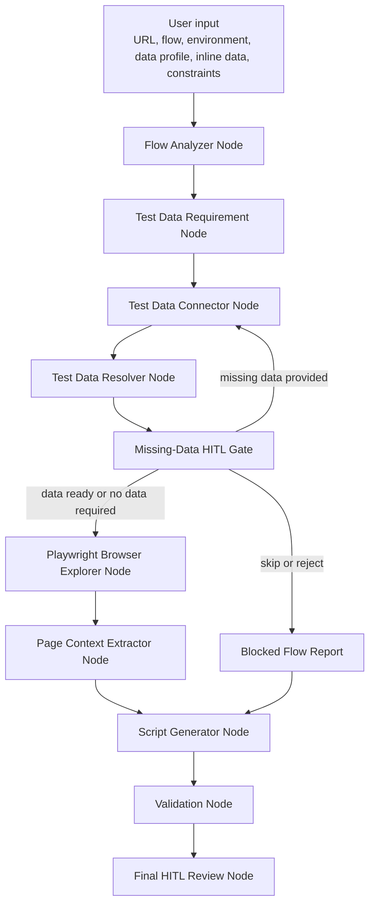

# Web Crawler Test Generation Agent

Minimal LangGraph agent that explores a focused user flow with Playwright and generates reviewable Playwright Test scripts in TypeScript.

## What It Does

- Accepts an application URL, high-level flow, optional test data, and optional constraints.
- Identifies required test data before browser exploration.
- Resolves data from inline input, environment variables, configured JSON/CSV files, safe named DB queries, or safe named API operations.
- Opens the target app with Python Playwright.
- Extracts compact page context instead of full HTML.
- Follows deterministic, flow-relevant controls instead of crawling the whole app.
- Generates `generated-tests/tests/generated-flow.spec.ts` in Playwright Test style using `generated-tests/fixtures/test-data.fixture.ts`.
- Writes HITL review metadata and reports.
- Runs only configured validation commands.

## LangGraph Workflow



## Detailed Docs

- [Agent docs index](DOCs/README.md)
- [Test data requirements](DOCs/test-data-requirements.md)
- [Test data connectors and resolver](DOCs/test-data-connectors.md)
- [Playwright browser explorer](DOCs/playwright-browser-explorer.md)

## Setup

```bash
python -m venv .venv
.venv\Scripts\activate
pip install -r requirements.txt
python -m playwright install
```

Install generated test dependencies:

```bash
cd generated-tests
npm install
npx playwright install
```

Optional LLM refinement uses LangChain with OpenAI:

```bash
set OPENAI_API_KEY=your_key
set CRAWLER_AGENT_MODEL=gpt-4o-mini
```

Without `OPENAI_API_KEY`, the agent uses deterministic parsing and script generation.

Create local environment variables from `.env.example` as needed. Do not commit `.env`.

## Run

```bash
python -m agent run ^
  --url "https://your-app.example" ^
  --environment "qa" ^
  --flow "Log in with valid credentials, open billing, verify the invoice list is visible" ^
  --test-data "{\"user\":{\"username\":\"qa_customer_01\",\"password\":\"set-at-runtime\",\"role\":\"customer\"}}" ^
  --constraints "{\"browser\":\"chromium\",\"headless\":true,\"pages_to_avoid\":[\"logout\",\"delete\"]}"
```

Use environment variables or placeholders for sensitive data. Do not hardcode real credentials in generated tests.

## Test Data Sources

Configure deterministic sources in `agent/config/data_sources.yaml`.

Supported sources:

- `inline`: user-provided `--test-data`
- `env`: environment variables mapped by config
- `json`: configured JSON files such as `generated-tests/test-data/users.json`
- `csv`: configured CSV files only
- `database`: disabled by default, read-only, predefined named queries only
- `api`: disabled by default, predefined operations only

The resolver priority is inline, env, JSON, CSV, database, API, synthetic data when allowed, then HITL missing-data request. The browser explorer starts only when required data is resolved or no data is required.

Postgres database resolution requires an approved `psycopg` installation; SQLite read-only paths are supported with `type: sqlite` for local QA fixtures.

## HITL Review

There are two HITL gates:

- Missing-data HITL before browser exploration, handled by `agent/nodes/missing_data_hitl.py`.
- Final generated-script review after validation, handled by `agent/nodes/hitl_review.py`.

After each run, inspect:

- `generated-tests/tests/generated-flow.spec.ts`
- `generated-tests/fixtures/test-data.fixture.ts`
- `reports/exploration_summary.md`
- `reports/test_data_requirements.md`
- `reports/resolved_test_data_summary.md`
- `reports/missing_test_data.md`
- `reports/missing_data_hitl.json`
- `reports/missing_info.md`
- `reports/validation_report.md`
- `reports/hitl_review.json`

Record review decisions:

```bash
python -m agent review --decision approve --notes "Reviewed and accepted"
python -m agent review --decision reject --notes "Wrong page was selected"
python -m agent review --decision changes --notes "Use email field before password"
```

If rejected or changes are requested, rerun the agent with clearer flow text or additional test data. The agent updates generated scripts and report metadata only.

For missing data, supported HITL responses are:

- Provide the exact missing fields with `--test-data`.
- Skip the flow.
- Use synthetic data, only when the requirement allows it.
- Change `agent/config/data_sources.yaml`.
- Reject and stop.

Record missing-data decisions:

```bash
python -m agent missing-data --decision provide --data "{\"user\":{\"username\":\"qa_customer_01\",\"password\":\"runtime-only\",\"role\":\"customer\",\"status\":\"active\"}}"
python -m agent missing-data --decision skip --notes "Skip checkout until QA user is provisioned"
python -m agent missing-data --decision synthetic --notes "Use only where syntheticAllowed is true"
python -m agent missing-data --decision change-source --notes "Enable qa JSON product file"
python -m agent missing-data --decision reject --notes "Cannot automate due to MFA"
```

Secrets passed to `missing-data --data` are masked in metadata; rerun `python -m agent run` with valid runtime data to continue exploration.

## Validation

The validator runs commands that are configured in `generated-tests/package.json`:

- `npm install`
- `npm run install:browsers`
- `npm run test:list`
- `npm run typecheck`
- `npm test`, only when `--run-tests` is supplied and no missing information was reported

If validation fails, fix only issues caused by generated code and rerun. If validation is blocked by credentials, CAPTCHA, OTP, MFA, network access, or unclear steps, provide the missing information rather than bypassing security controls.

## Security Rules

- No arbitrary SQL is generated or executed.
- No arbitrary API operation is generated or executed.
- Database connector uses read-only named queries and environment-sourced connection strings.
- API connector uses environment-sourced base URL and token.
- Reports mask passwords, tokens, API keys, connection strings, OTPs, PINs, card numbers, and CVVs.
- Generated tests use environment variables for secrets.

## Token Optimization

- The LLM is optional and only used for flow interpretation or final script refinement.
- Test data fetching is deterministic connector code; the LLM does not read files, call APIs, query databases, or access secrets.
- Full HTML is never sent to the LLM.
- Page context is compacted to URL, title, visible buttons, links, inputs, ARIA roles, and error messages.
- Page summaries are cached by URL during a run.
- Deterministic scoring chooses actions whenever visible labels, roles, placeholders, and stable test IDs are sufficient.
